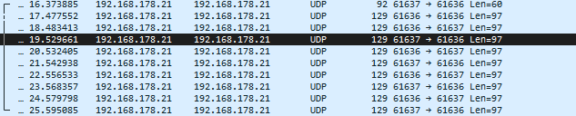
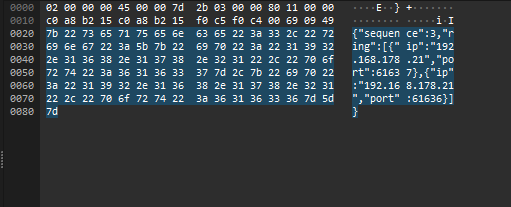

Maxim Smirnov

## **Aufgabe 1)**

Ich habe den Tokenring mit Intellij gestartet und mehrere Instanzen des Programms in Intellij erlaubt.
Dann habe ich das erste Programm ohne Argumente gestartet, was den Tokenring initialisiert hat und danach zwei weitere
Instanzen mit der passenden IP und Port gestartet.

Der Code erstellt in der main-Funktion zunächst ein UDP-Socket und verbindet es mit 8.8.8.8:10002.
Dies dient ausschließlich dazu, die eigene IP-Adresse und den vom System zugewiesenen Port zu ermitteln. 
Anschließend wird das Socket wieder geschlossen.
Die ermittelte IP-Adresse und der Port können nun im Terminal ausgegeben werden, damit sich andere Teilnehmer verbinden
können.
Wird das Programm ohne Argumente gestartet, erstellt die loop()-Funktion eine Kandidatenliste mit der eigenen IP-Adresse
und dem eigenen Port und wartet auf den Empfang eines Pakets.
Sobald das erste Paket empfangen wurde, wird der enthaltene Token in der Konsole ausgegeben.
Das andere Programm, also der Sender des Tokens, wird zur Kandidatenliste hinzugefügt, da bislang nur ein Teilnehmer, im 
ausgegebenen Token, vorhanden ist.
Anschließend werden die aktuellen Kandidaten in das Token geschrieben, und dieses wird an den nächsten Teilnehmer
im Ring weitergeleitet.
Wenn weitere Teilnehmer hinzukommen, werden sie entsprechend in den Ring eingefügt.

Beispiel für Token-Ring mit drei Teilnehmer:

UDP endpoint is (192.168.178.21, 57452)  
Received {"sequence":0,"ring":[{"ip":"192.168.178.21","port":54893}]} from 192.168.178.21:54893  
Token: seq=0, #members=1 (192.168.178.21, 54893)  
Sending {"sequence":1,"ring":[{"ip":"192.168.178.21","port":54893},{"ip":"192.168.178.21","port":57452}]} to 192.168.178.21:57452  
Received {"sequence":1,"ring":[{"ip":"192.168.178.21","port":54893},{"ip":"192.168.178.21","port":57452}]} from 192.168.178.21:57452  
Token: seq=1, #members=2 (192.168.178.21, 54893) (192.168.178.21, 57452)  
...  
Sending {"sequence":10,"ring":[{"ip":"192.168.178.21","port":57452},{"ip":"192.168.178.21","port":54893}]} to 192.168.178.21:54893  
Received {"sequence":0,"ring":[{"ip":"192.168.178.21","port":49528}]} from 192.168.178.21:49528  
Token: seq=0, #members=1 (192.168.178.21, 49528)  
Received {"sequence":11,"ring":[{"ip":"192.168.178.21","port":54893},{"ip":"192.168.178.21","port":57452}]} from 192.168.178.21:54893  
Token: seq=11, #members=2 (192.168.178.21, 54893) (192.168.178.21, 57452)  
Sending {"sequence":12,"ring":[{"ip":"192.168.178.21","port":57452},{"ip":"192.168.178.21","port":49528},{"ip":"192.168.178.21","port":54893}]} to 192.168.178.21:54893  
Received {"sequence":13,"ring":[{"ip":"192.168.178.21","port":49528},{"ip":"192.168.178.21","port":54893},{"ip":"192.168.178.21","port":57452}]} from 192.168.178.21:54893  
Token: seq=13, #members=3 (192.168.178.21, 49528) (192.168.178.21, 54893) (192.168.178.21, 57452)  
Sending {"sequence":14,"ring":[{"ip":"192.168.178.21","port":54893},{"ip":"192.168.178.21","port":57452},{"ip":"192.168.178.21","port":49528}]} to 192.168.178.21:49528  
Received {"sequence":16,"ring":[{"ip":"192.168.178.21","port":49528},{"ip":"192.168.178.21","port":54893},{"ip":"192.168.178.21","port":57452}]} from 192.168.178.21:54893  

## **Aufgabe 2)**

Ich habe es mit einem Kommilitonen im Uni-Netz ausprobiert, aber leider hat es nicht funktioniert. Da muss das Uni-Netz irgendwas blockiert haben.
Wir konnten das Problem leider nicht finden. Lokal auf meinem eigenen Rechner hat es hingegen funktioniert.
Hier sind die Ausgaben aus dem Terminal beim Versuch im Uni-Netz:

Einmal als Sender....

PS C:\Users\Maxim\Documents\GitHub\TokenRingUDP-2025S> java -jar TokenRingUDP.jar 136.199.105.180 48305  
UDP endpoint is (136.199.105.177, 65135)  
Sending {"sequence":0,"ring":[{"ip":"136.199.105.177","port":65135}]} to 136.199.105.180:48305  

Einmal als Empfänger...

PS C:\Users\Maxim\Documents\GitHub\TokenRingUDP-2025S> java -jar TokenRingUDP.jar  
UDP endpoint is (136.199.105.177, 54119)  

## **Aufgabe 3)**

In Wireshark habe ich mit dem Anzeigefilter „udp“ die Pakete des Token-Rings herausgefiltert (siehe Screenshots).
Darin lässt sich der Inhalt des Tokens gut erkennen, der die IP-Adressen und Ports der Teilnehmer enthält.
Im Screenshot ist der Token mit folgendem Inhalt zu sehen: {"ip":"192 168.178.21","po rt":61637},{"ip":"192.168.178.21","port":61636}

## **Aufgabe 4)**

Name des Branches: masmir